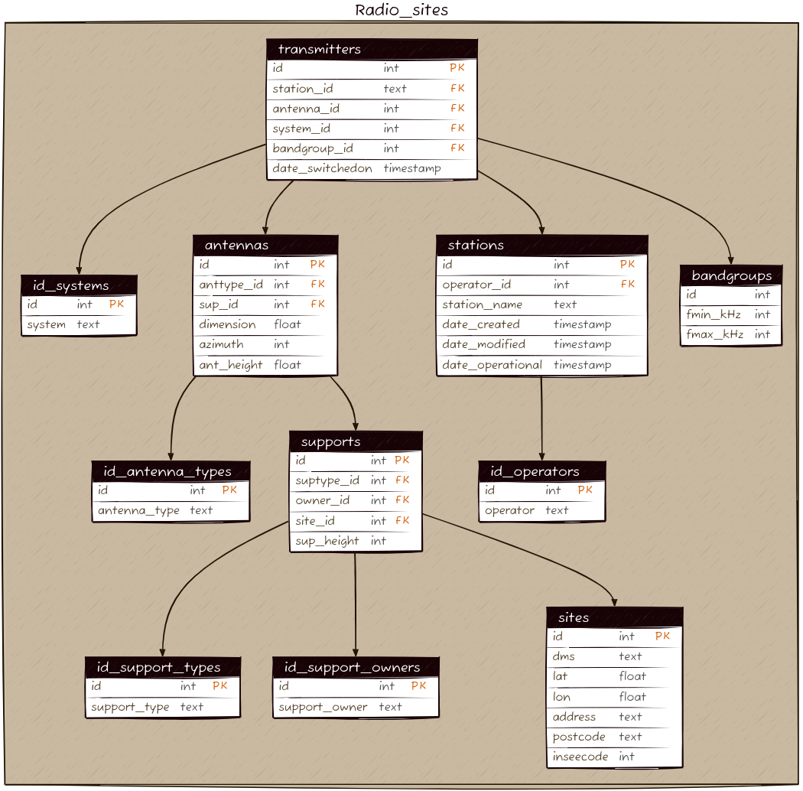

# fradiodb
This tool helps process the [French open data on radio sites > 5W](https://www.data.gouv.fr/fr/datasets/donnees-sur-les-installations-radioelectriques-de-plus-de-5-watts-1/).
That data actually has a some duplications, and the tables and field names as well as the schema are not always very straightfoward, therefore some processing is done in order to obtain the following target schema:

Then, the tool also enable the creation of tables `gen_sites` and `gen_sectors` (possibly in another DB) to summarize within a single table some useful information from the standpoint of sites (i.e. geographical address) and sectors (i.e. with a boresight), e.g. for the purpose of importing in a GeoDataFrame and mapping with leaflet.js.
