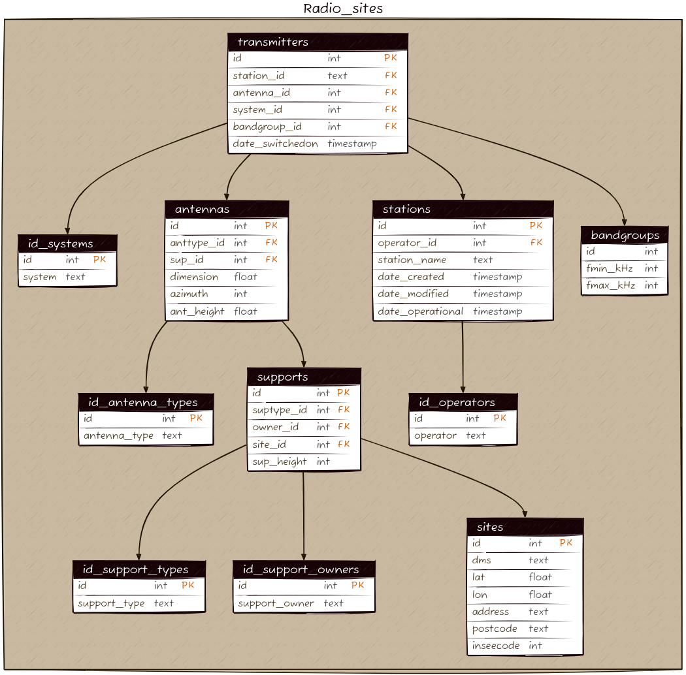

# fradiodb
This tool helps process the [French open data on radio sites > 5W](https://www.data.gouv.fr/fr/datasets/donnees-sur-les-installations-radioelectriques-de-plus-de-5-watts-1/) and import it into an SQLite database that is easy to process and query (now updated to be a full geopackage that can be used in any GIS tool such as QGIS).
The original CSV actually has duplicate data, and the tables and field names as well as the schema are not always very straightfoward, therefore some processing is done in order to obtain the following target schema that is (hopefully) easier to work with:

It is to be noted that
* Table `sites` was created because there may be several supports at the same location
* One support obviously has several stations, but conversely the current definition of "station" may encompass several transmitters that (due to historical reasons) may be on different supports
* `bandgroups.id` is not a PK (it's not unique). I could have defined another table "bands_id" where bands would have been unique, but this would add complexity and overall the amount of band combinations is only 2x the amount of distinct bands

More details are explained (in French) on [this webpage](https://blog.karteum.ovh/posts/fradiodb/).

This repository also includes the frontend and backend for my website [radiomap](https://radiomap.karteum.ovh/).

## Usage
* `fradiodb.py foo.db geopackage [-p mydir/]` : first step, you should imports and process the CSV data from directory `mydir` (by default `anfr`) into the SQLite DB `foo.db` (which is actually a geopackage that can be used in any GIS environment such as QGIS)
* `fradiodb.py foo.db serve` : second, you may launch a web server showing a map of radio sites
